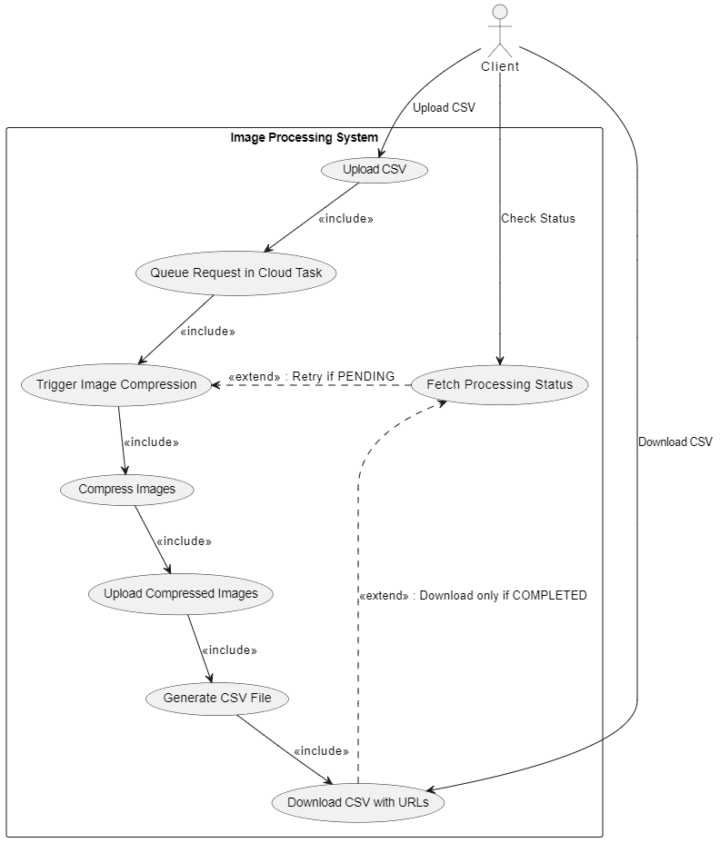
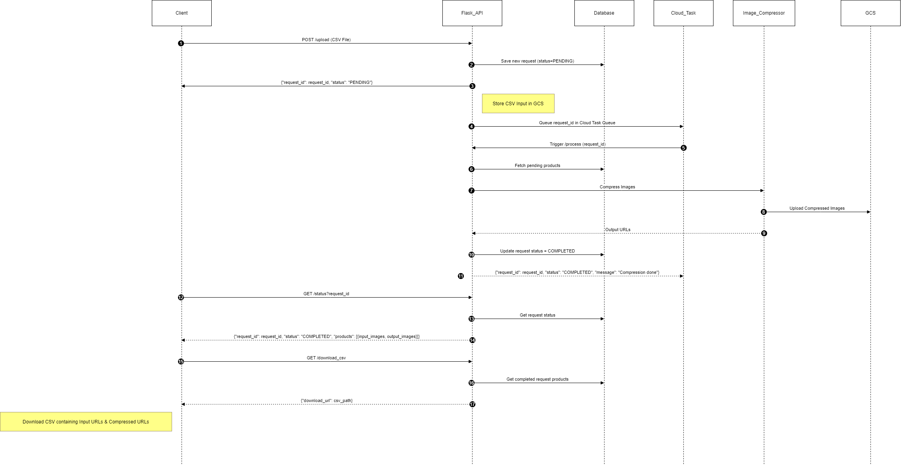
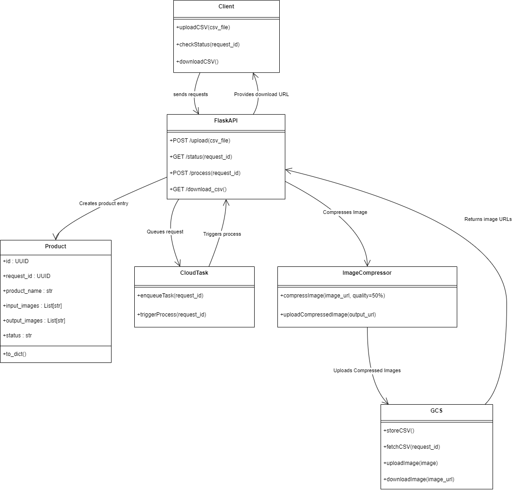

# Image Processing Leveraging Google Cloud

This project implements an image compression service that leverages Google Cloud Platform (GCP) services such as Google Cloud Storage, Cloud Run, Cloud SQL, and Cloud Tasks. It downloads images from public URLs, compresses them using the Pillow library (JPEG format with 50% quality), and uploads the compressed images to Google Cloud Storage. The system generates public URLs for the compressed images and queues requests for asynchronous processing.

## Features
- **Download Images:** Retrieve images from public URLs.
- **Image Compression:** Compress images using the Pillow library (JPEG format at 50% quality).
- **Cloud Storage Integration:** Upload and store compressed images on Google Cloud Storage.
- **Public URL Generation:** Automatically generate public URLs for the compressed images.
- **Asynchronous Processing:** Use Google Cloud Tasks to queue and process image compression requests asynchronously.
- **CSV Generation:** Generate a downloadable CSV file containing both original and compressed image URLs.
- **Webhook Notifications:** Configure webhooks to receive notifications when processing is complete.

## Technologies Used
- **Flask:** Backend API framework.
- **Google Cloud Storage:** Image storage service.
- **Cloud Run:** Deployment platform.
- **Cloud SQL (PostgreSQL):** Database for storing product metadata (input/output image URLs, status, request IDs).
- **Cloud Tasks:** Queue management for asynchronous processing.
- **Requests:** Library for downloading images.
- **Pillow:** Library for image processing and compression.

## Project Structure
```
.
├── database/ # Database configuration and models
│ ├── init.py
│ ├── config.py
│ ├── database.py
│ └── models.py
├── app.py # Main Flask application
├── cloud_tasks.py # Cloud Tasks queue management
├── cloudbuild.yaml # Google Cloud Build configuration
├── Dockerfile # Containerization configuration
├── download_csv_operations.py # CSV generation utilities
├── image_processor.py # Image processing and GCS operations
├── requirements.txt # Python dependencies
├── webrook.py # Webhook configuration (presumed)
├── .gitignore # Version control exclusion list
└── README.md # Project documentation
```

## Installation and Setup

1. **Clone the Repository:**
   ```bash
   git clone https://github.com/your-username/image-processing-leveraging-cloud.git
   cd image-processing-leveraging-cloud
   ```

2. **Install Dependencies:**
   ```bash
   pip install -r requirements.txt
   ```

3. **Environment Configuration:**
   Create a `.env` file in the root directory with:
   ```ini
   ENV=local
   DB_USER=postgres
   DB_PASS=yourpassword
   DB_HOST=localhost
   DB_NAME=image_processing
   GCS_BUCKET_NAME=your-gcs-bucket-name
   INSTANCE_CONNECTION_NAME=your-instance-connection-name
   WEBHOOK_URL=https://your-webhook-url
   ```

4. **Run the Application:**
   ```bash
   python app.py
   ```

## API Documentation

### POST /upload
**Description:** Upload CSV file containing image URLs  
**Input:** CSV file (multipart/form-data)  
**Output:** 
```json
{
  "request_id": "uuid",
  "status": "PENDING"
}
```

### GET /status
**Description:** Check processing status  
**Parameters:** `request_id` (UUID)  
**Output:**
```json
{
  "request_id": "uuid",
  "status": "COMPLETED",
  "products": [
    {
      "id": "id",
      "product_name": "name",
      "input_images": "input_url",
      "output_images": "output_url",
      "status": "COMPLETED"
    }
  ]
}
```

### POST /process
**Description:** Trigger image compression (internal use by Cloud Tasks)  
**Input:**
```json
{
  "request_id": "uuid"
}
```
**Output:**
```json
{
  "request_id": "uuid",
  "status": "COMPLETED",
  "message": "Processed successfully"
}
```

### GET /download_csv
**Description:** Generate CSV with compressed URLs  
**Output:**
```json
{
  "download_url": "csv_url"
}
```

## Webhook Configuration
Configure real-time notifications by setting these in `.env`:
```ini
POSTMAN_MOCK_WEBHOOK_URL=https://your-postman-mock-server-url
# OR
WEBHOOK_URL=https://your-webhook-endpoint-url
```

**Payload Format:**
```json
{
  "request_id": "uuid",
  "status": "COMPLETED",
  "message": "Compression done"
}
```

## Asynchronous Workers Documentation
- **Cloud Tasks:** Queues compression requests and triggers processing
- **Worker Functions:** Handles image download, compression (50% quality), GCS upload, and database updates

## Diagrams

<h3>Use Case Diagram</h3>
<div align="center">
  
</div>

<h3>Sequence Diagram</h3>
<div align="center">
  
</div>

<h3>Class Diagram</h3>
<div align="center">
  
</div>


## Additional Information
- Ensure proper IAM permissions for GCP services
- Local testing requires valid `.env` configuration
- Refer to UML conventions for diagram creation
- Sample Postman collection available for API testing

Happy compressing!
